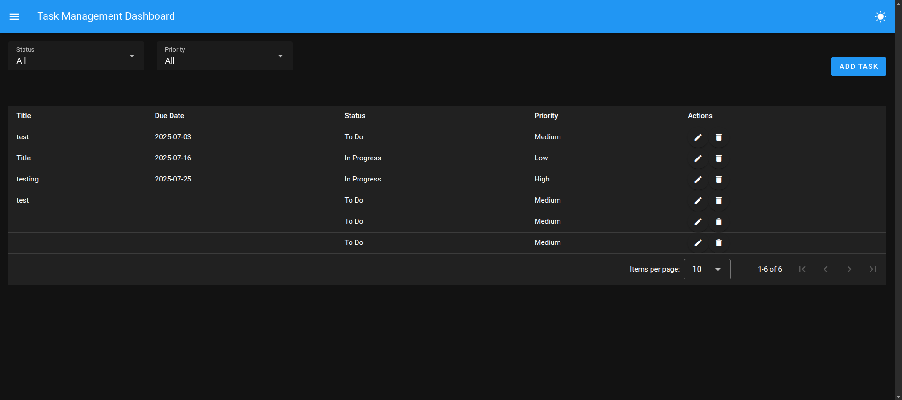
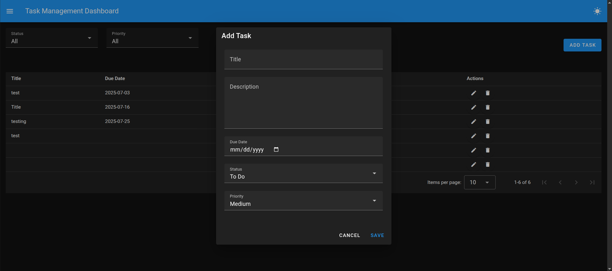
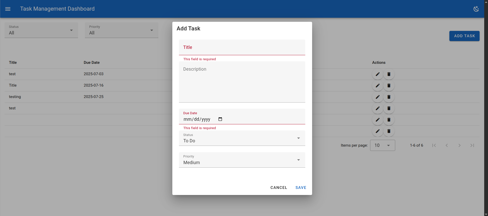

# 📝 Task Management Dashboard

A responsive task management application built with **Vue 3**, **Vuetify 3**, and **Pinia**.

---

## ✨ Features

* ✅ Responsive Dashboard layout with sidebar and top navbar
* ✅ Add, Edit, Delete Tasks
* ✅ Form Validations with Vuetify rules
* ✅ Filter Tasks by **Status** and **Priority**
* ✅ Light/Dark Theme Toggle in Navbar
* ✅ Persist Data with **localStorage**

---

## 📱 Mobile Responsive Design

* Uses Vuetify Grid and Responsive Display Utilities
* Dialogs switch to fullscreen on mobile
* Sidebar changes to temporary drawer on smaller screens

---

## 💻 Tech Stack Used

* **Vue 3 + Composition API**
* **Vuetify 3 (Material Design UI)**
* **Pinia (State Management)**
* **VueDraggable (SortableJS)** for Drag-and-Drop
* **TypeScript**
* **Vite** (Development & Build Tool)

---

## 🚀 Getting Started

### 1️⃣ Clone the Repository

```bash
git clone <repo-url>
cd task-dashboard
```

### 2️⃣ Install Dependencies

```bash
npm install
```

### 3️⃣ Start Development Server

```bash
npm run dev
```

### 4️⃣ Build for Production

```bash
npm run build
```

---

## 🗂️ Project Structure

```
src/
├── components/
│   ├── FilterBar.vue
│   ├── TaskFormModal.vue
│   └── TaskList.vue
├── layouts/
│   └── DashboardLayout.vue
├── pages/
│   └── DashboardPage.vue
├── plugins/
│   └── vuetify.ts
├── stores/
│   └── taskStore.ts
├── App.vue
├── main.ts
└── vite.config.ts
```

---

## 🌓 Light/Dark Theme Toggle

* Accessible toggle button in the navbar
* Switches between **Light** and **Dark** themes using Vuetify's `useTheme`

---

## 📸 Screenshots

*(Add screenshots here to showcase desktop and mobile views)*





---

## 📃 License

This project is licensed under the **MIT License**.

---

## 🙌 Author

**\[Mukul Jangra]**
\[9971265654]
\[[GitHub Profile / Portfolio Link](https://github.com/mukul-logezy)]


---

Feel free to fork, modify, and contribute to this project!
# Task-manager
